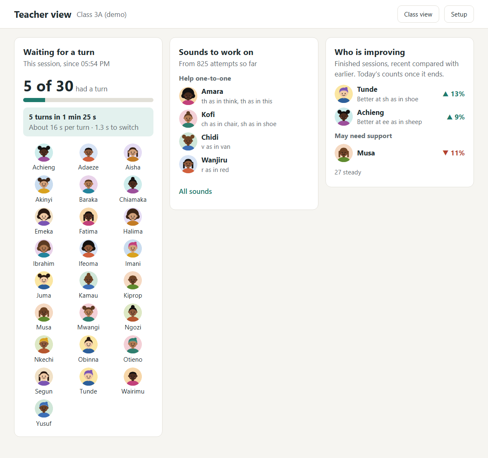

# Class-Flow

Classroom mode for Cobalt CAPT: one shared tablet, thirty children.

Children practise pronunciation on a single shared device with no logins. A child taps their picture, hears a prompt, says it, and gets instant feedback from [Cobalt CAPT](https://demo.cobaltspeech.com/capt/). Each child's progress is kept separately.

The teacher view shows the three things a teacher would act on:

1. **Which sounds the class struggles with**, aggregated from CAPT's per-sound scores.
2. **Who hasn't had a turn** this session.
3. **Who is improving**, comparing each child's recent finished sessions with earlier ones, sound by sound.

This is quest **F-9** from CoW 26.3. The goal is to show five learners going through one device in five minutes, then the teacher view.

## Results

- **Five learners in 1 min 26 s**, about 16 s per turn and 1.3 s to switch to the next child, scored by the real CAPT ([demo run](docs/demo-run.md)).
- **6 of 6 planted pronunciation errors found** by the teacher view, with no child named who shouldn't be, and 2 false alarms (knock-on effects in one child's mispronounced words) ([answer-key check](docs/answer-key-check.md)).
- **Children's data never leaves the tablet**: no accounts, no cloud copies, no exports.



## Quick start: run the demo

You need [Go](https://go.dev/dl/) 1.27 or later, [Node.js](https://nodejs.org) 24 or later, and an internet connection (scoring uses CAPT on demo.cobaltspeech.com).

```sh
git clone https://github.com/Kennethmgunde/Class-Flow-Fast-Switching-Focus.git class-flow
cd class-flow/web && npm install && npm run build
cd ../server && go run .
```

Then open http://localhost:8080/#/check, press **Load demo class**, tick **Demo voices**, and follow the [demo script](docs/demo-script.md): what to tap, what to say, and what to do if something goes wrong.

## Architecture

```
Browser (tablet)  ──►  server/ (CAPT proxy)  ──►  demo.cobaltspeech.com/capt
   web/                  keeps CAPT calls
   UI, recording,        server-side
   on-device storage
```

The browser can't call CAPT directly, because the demo server sends no CORS headers. `server/` forwards scoring requests and serves the web app.

| Folder    | Contents                                                     |
|-----------|--------------------------------------------------------------|
| `web/`    | The tablet web app: roster, practice flow, teacher view      |
| `server/` | CAPT proxy (REST `/evaluate` and WebSocket `/streaming-evaluate`) |
| `tools/`  | VoiceGen speech synthesis (`voicegen.ts`), prompt clips (`make-prompt-audio.ts`), the simulated learners' audio (`make-test-audio.ts`), the answer-key check (`check-answer-key.ts`), prompt and live CAPT checks |
| `docs/`   | [Demo script](docs/demo-script.md), [demo run](docs/demo-run.md) with timings, [answer-key check](docs/answer-key-check.md), [sales one-pager](docs/sales-one-pager.md) |

## Stack

- **web/**: TypeScript with [Vite](https://vite.dev), no framework. Node.js 24 LTS.
- **server/**: Go 1.27, standard library only. It serves the built web app and forwards `/api/capt/*` to CAPT, including WebSocket upgrades.

## Running it

Development, with live reload (two terminals):

```sh
# Terminal 1: Go server (CAPT proxy) on :8080
cd server && go run .

# Terminal 2: Vite dev server on :5173, forwards /api to :8080
cd web && npm install && npm run dev
```

Open http://localhost:5173. The page should say **CAPT connected**.

Single server, as for the demo:

```sh
cd web && npm run build
cd ../server && go run .     # serves web/dist and the proxy on :8080
```

Server flags: `-addr` (default `:8080`), `-capt` (CAPT base URL), `-web` (built web app directory).

Tests: `cd web && npm test`. These run offline, using CAPT responses saved in `web/test/fixtures/`.

Live CAPT check, which sends a few requests to the shared demo server through the Go proxy (run it occasionally, not in a loop):

```sh
cd server && go run .               # terminal 1
node tools/capt-live-check.ts       # terminal 2, from the repo root
```

It synthesizes speech with VoiceGen, checks REST, WebSocket, a planted error and an out-of-vocabulary word, and refreshes the fixtures.

### Demo class

Open `#/check` and press **Load demo class**: 30 children with three weeks of simulated practice and today's session open and empty, so the teacher view has real content. It includes the five simulated learners and their planted errors (Amara th, Chidi v, Wanjiru r, Kofi sh and ch; Zuri none), plus Tunde and Achieng improving and Musa slipping. **Remove demo class** deletes it. Loading it again gives an identical class.

### Demo voices

The quest doesn't allow recording children, so the five simulated learners speak with synthesized voices (VoiceGen, with their planted errors spelled out: "I tink dere are tree"). With **Demo voices** ticked on `#/check`, tapping the microphone for Amara, Chidi, Wanjiru, Kofi or Zuri *in the demo class* plays their clip aloud and sends it to the real CAPT, exactly as a recording would. Their turn screen shows a **Demo voice** badge. Every other child, and every real class, always uses the microphone.

The clips ship in `web/public/demo-voices/`. To remake them (VoiceGen, 70 requests): `node tools/make-test-audio.ts --all`, then rescore with `node tools/check-answer-key.ts --rescore`.

### Turn timing

Each turn is timed on the tablet, from the child's turn screen opening to them handing back (turns with no recording, like "Not me", aren't counted). The teacher view's **Waiting for a turn** panel shows, for the current or last session: "5 turns in 4 min 26 s · about 50 s per turn · 4.0 s to switch". A switch is the gap between one child handing back and the next starting; gaps over two minutes count as breaks.

### Microphone and HTTPS

Browsers only allow the microphone on `https://` pages or `localhost`. Opening the app on a tablet at `http://<laptop-ip>:8080` blocks the mic. For the tablet demo, serve over HTTPS or use a tunnel.

## Audio

The mic is captured at the browser's native rate (usually 44.1 or 48 kHz) and resampled to 16 kHz mono 16-bit WAV with `OfflineAudioContext` (`web/src/audio/`). Opening an `AudioContext` at 16 kHz directly fails in Firefox when a mic stream is connected to it.

## CAPT notes

- REST `POST /capt/api/capt/v1/evaluate` for prompts under about 8 seconds. Longer prompts return a 503, so use WebSocket `/capt/api/capt/v1/streaming-evaluate` for those.
- Audio must be 16 kHz mono 16-bit WAV.
- Reference text must be dictionary words with no punctuation. Names and rare words fail as out-of-vocabulary (HTTP 500).
- The demo server is shared. Don't load-test it or run automated suites against it without agreeing with the Cobalt team first.

## Data and privacy

- No human recordings: test audio is synthesized (quest rule).
- Learners are stored by first name or avatar only, on the device.
- Storage is IndexedDB in the browser (`web/src/store.ts`): classes, learners, sessions and attempts, with each attempt holding CAPT's per-word and per-sound scores. Nothing is sent to a server except the audio CAPT scores.
- Deleting a learner or a class also deletes their attempts. **Wipe everything on this tablet** (in setup) clears all classes, scores and the PIN; it shows exactly what will go and needs WIPE typed to confirm. There are no backups or exports: children's data is never copied off the tablet, so a wipe can't be undone.
- Recordings are never stored: each is sent to CAPT with the sentence only (no name or id), scored, and discarded. Tests check both.

## Teacher PIN

In setup, the teacher can set a 4-digit PIN. With a PIN set, setup, the teacher view and `#/check` ask for it; children's screens never do. Going to the class view locks the teacher's screens again, and so do 30 minutes. After 5 wrong tries the keypad pauses for 30 seconds. **Forgot PIN?** Hold it for 5 seconds to remove the PIN; no data is lost. It keeps children out; it isn't a security boundary.

## Project tracking

Linear project: [Class-Flow & Fast Switching Focus](https://linear.app/cobaltspeech/project/class-flow-and-fast-switching-focus-013a65a45f13) (tasks TRA-792 to TRA-815).

Branch names follow Linear's format, for example `kgunde/tra-795-capt-client-integration-rest-websocket`.
