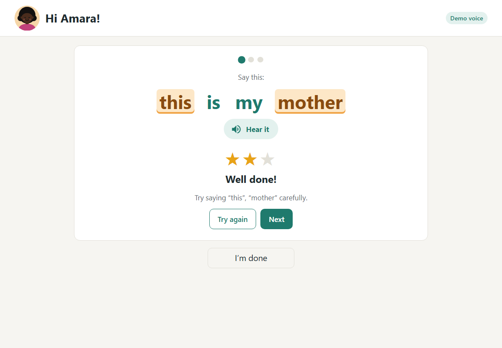

# Demo run (TRA-813)

The quest's "Show us": five learners through one tablet in five minutes, then the teacher view.

**Result: five learners in 1 min 26 s, then the teacher view, which named exactly the planted errors.**

## How the demo works

No child's voice is recorded (quest rule). The five learners are the simulated learners from TRA-809, each with planted pronunciation errors, and they speak with synthesized voices: when a child taps the microphone, the app plays that child's clip aloud, so the audience hears "I tink dere are tree", and sends the clip to the real CAPT, exactly as it would a recording. The turn screen shows a **Demo voice** badge so nobody mistakes it for live speech.

Demo voices only apply to Amara, Chidi, Wanjiru, Kofi and Zuri in the demo class, and only when switched on. Every other child, and every real class, uses the microphone.

| Learner | Planted error | What the audience hears |
|---|---|---|
| Amara | th said as t or d | "I tink dere are tree" |
| Chidi | v said as b | "bery good boice" |
| Wanjiru | r said as l | "the led labbit luns" |
| Kofi | sh said as s, ch as sh | "see has new soos" |
| Zuri | none (the control) | "very good voice" |

## Running it

1. Start the server: `cd server && go run .`, then open http://localhost:8080 (build the app first with `cd web && npm run build`).
2. **Setup → Check**: press **Load demo class** and tick **Demo voices**. The demo class is "Class 3A (demo)": 30 children and three weeks of simulated practice, with today's session open and empty.
3. **Class view**: tap Amara, then for each of her three sentences tap the microphone, wait for the stars, and tap **Next** (or **Finish**), then **I'm done**. Repeat for Chidi, Wanjiru, Kofi and Zuri.
4. **Teacher view**: show the three panels:
   - **Waiting for a turn**: 5 of 30, with the time the five turns took and the average switch time.
   - **Sounds to work on**: the four children with planted errors, each with exactly their sounds; Zuri isn't named.
   - **Who is improving**: Tunde and Achieng improving, Musa needing support (from the three weeks of history).

## The recorded run

Run on 2026-10-09 in Chrome (headless, 1180 × 820, tablet size), with the real CAPT on demo.cobaltspeech.com. A script tapped the buttons at a steady 1.2 s per tap; a presenter talking the audience through it will be slower, and five minutes leaves 60 s per child.

| Learner | Turn | Sentences, stars, and words marked to practise |
|---|---|---|
| Amara | 15.9 s | "this is my mother" ★★ *this, mother* · "she has new shoes" ★★★ · "I think there are three" ★★ *there, three* |
| Chidi | 15.7 s | "she has new shoes" ★★★ · "my thumb is thin" ★ *thumb, thin* · "the sheep is on the ship" ★★★ |
| Wanjiru | 15.8 s | "they are over there" ★★★ · "I think there are three" ★★ *are, three* · "the sheep is on the ship" ★★★ |
| Kofi | 16.0 s | "very good voice" ★★★ · "a little lamp is lit" ★★★ · "the red rabbit runs" ★★★ |
| Zuri | 16.0 s | "very good voice" ★★★ · "she has new shoes" ★★★ · "a little lamp is lit" ★★ *lit* |

- **Five learners: 1 min 26 s** from the first tap on the roster to the last "I'm done". The app's own timing line said "5 turns in 1 min 25 s, about 16 s per turn, 1.3 s to switch".
- **CAPT:** 15 requests, 2.2 to 2.8 s from tapping the microphone to the stars (that includes playing the clip aloud, about 1.5 to 2 s).
- The app picks each child's sentences itself, so which ones come up varies; Chidi's and Kofi's sentences in this run didn't include their planted sounds, which is why their stars are high. Their errors show in the teacher view from the earlier sessions.
- Chidi's one star on "my thumb is thin" is the synthesized voice, not a planted error: CAPT scores that clip low. The teacher view doesn't name him for "th": in TRA-811 it was weak in only that one sentence, and the two-sentence rule kept it out.

## What the rehearsals changed

Three earlier rehearsals (33 CAPT requests, one at a time; 48 counting the recorded run) found two problems, both fixed:

1. **A live turn showed as progress.** After the first rehearsal, "Who is improving" listed Amara, "better at th as in think, ▲ 11%", next to "Help one-to-one: Amara, th". Today's three sentences were a different mix of words from her past ones, and CAPT's scores depend on the word (her "de" drags down nearby vowels, for example), so one short turn moved her trend. Building the history from her real CAPT results didn't help (still ▲ 7%, and three extra false alarms), because the cause is the mix of sentences, not the history. **Fix:** trends now count finished sessions only, so a lesson in progress doesn't move anyone's trend until it ends; the panel says so ("Today's counts once it ends"). This applies to real classes too: halfway through a lesson, some children have had their turn and others haven't.
2. **One clip CAPT can't make out.** Chidi's "a little lamp is lit" scores 0.04 (the synthesizer garbled it; it's the single bad recording noted in TRA-811). In a demo, replaying the same clip would leave him stuck on "Try again". **Fix:** demo mode skips that one clip for Chidi; a test checks that every clip demo mode can play is one CAPT makes out.

## Rerunning

The clips ship with the app in `web/public/demo-voices/` (70 WAVs, 3.4 MB). To remake them: `node tools/make-test-audio.ts --all`, which also copies them there, then `node tools/check-answer-key.ts --rescore` to rescore them and update the TRA-811 report.
